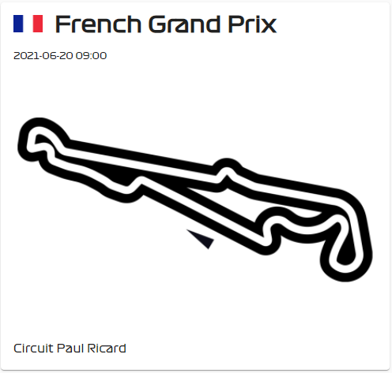
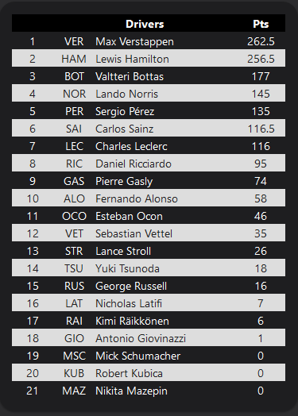
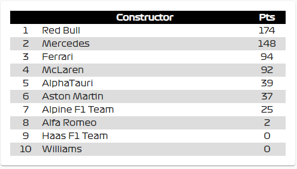

# Frontend Example
The goal is to eventually have a custom lovelace card to display the sensor's information. In the meantime, a makeshift scdisplayoreboard can be created using template Markdowns. Follow the steps below to get a result similar to this:

To display the next race:

 
```
- type: markdown
  card_mod:
    style:
      ha-markdown$: |
        * {
          font-family: FormulaOne, "Titillium Web";
        }
  content: >-
       
     <h1>&nbsp;
    {{ race.raceName }}</h1>

    <small>{{ as_timestamp(race.date + ' ' + race.time) |
    timestamp_custom("%Y-%m-%d %H:%M") }}</small>

    <a target="_new" href="{{race.Circuit.url}}"></a>
    {{race.Circuit.circuitName}}   
    
```

To display the Driver standings:


```
type: markdown
card_mod:
  style:
    ha-markdown$: |
      * {
        font-family: FormulaOne, "Titillium Web";
      }
      table {
        width: 100%;
        border-spacing: 0;
        border-collapse: separate;
      }
      th {
        color: white;
        background: black;
      }
      tr:nth-child(even) {
        background-color: #dddddd;
        color: rgb(33,33,33);
      }
      td:nth-child(1) {
        width: 50px;
        text-align: center;
      }
      td:nth-child(2) {
        width: 50px;
        text-align: center;
      }
      td:nth-child(4) {
        width: 60px;
        text-align: center;
      }
content: |-
  <table>
    <thead>
      <tr>
        <th>&nbsp;</th>
        <th colspan="2">Drivers</th>
        <th class="center">Pts</th>
      </tr>
    </thead>
    <tbody>
   
      <tr>
          <td>{{driver.position}}</td>
          <td>{{driver.Driver.code}}</td>
          <td>{{driver.Driver.givenName }} {{driver.Driver.familyName }}</td>
          <td>{{driver.points}}</td>
      </tr>
  
    </tbody>
  </table>
```

To display the Constructor standings:


```
type: markdown
card_mod:
  style:
    ha-markdown$: |
      * {
        font-family: FormulaOne, "Titillium Web";
      }
      table {
        width: 100%;
        border-spacing: 0;
        border-collapse: separate;
      }
      th {
        color: white;
        background: black;
      }
      tr:nth-child(even) {
        background-color: #dddddd;;
        color: rgb(33,33,33);
      }
      td:nth-child(1) {
        width: 50px;
        text-align: center;
      }
      td:nth-child(2) {
        text-align: left;
      }
      td:nth-child(3) {
        width: 60px;
        text-align: center;
      }
content: |-
  <table>
    <thead>
      <tr>
        <th>&nbsp;</th>
        <th>Constructor</th>
        <th class="center">Pts</th>
      </tr>
    </thead>
    <tbody>
   
      <tr>
          <td>{{driver.position}}</td>
          <td>{{driver.Constructor.name }}</td>
          <td>{{driver.points}}</td>
      </tr>
  
    </tbody>
  </table>
```
